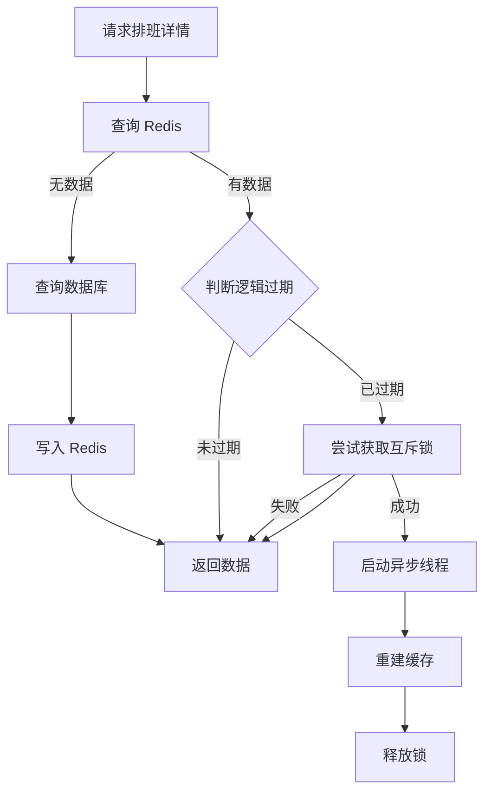

# PSSRS 医院挂号系统详细设计说明书

## 1. 引言

### 1.1 编写目的
本文档旨在为PSSRS（Patient Self-Service Registration System）医院挂号系统提供详细的技术实现蓝图。本文档作为软件开发阶段的核心依据，指导开发人员进行编码实现、测试人员进行单元测试与集成测试，以及为后续的系统维护提供技术参考。

**目标读者**：
- 后端开发工程师
- 前端开发工程师
- 测试工程师
- 系统运维工程师

### 1.2 背景说明
- **项目名称**：PSSRS 医院挂号系统 (Patient Self-Service Registration System)
- **提出单位**：医院信息化建设委员会
- **开发团队**：PSSRS 项目开发组
- **最终用户**：患者（小程序端）、医生（Web端）、医院管理员（Web端）
- **运行环境**：
    - 服务端：Linux/Windows Server, Java 17, MySQL 8.0, Redis 6.0
    - 客户端：微信小程序（WeChat 8.0+），现代浏览器（Chrome 90+, Edge 90+）

### 1.3 术语定义
- **JWT (JSON Web Token)**：一种用于双方之间传递安全信息的简洁的、URL安全的表述性声明规范，用于身份认证。
- **MyBatis-Plus**：MyBatis 的增强工具，在 MyBatis 的基础上只做增强不做改变，为简化开发、提高效率而生。
- **乐观锁 (Optimistic Locking)**：假设数据一般情况下不会造成冲突，所以在数据进行提交更新的时候，才会正式对数据的冲突与否进行检测。

### 1.4 参考资料
- 《PSSRS 医院挂号系统需求规格说明书》
- 《PSSRS 医院挂号系统概要设计说明书》
- GB/T 8567-2006 《计算机软件文档编制规范》
- Spring Boot 官方文档
- Vue.js 3.0 官方文档

## 2. 系统架构设计

### 2.1 模块结构图
系统采用分层架构设计，主要包含以下模块：

- **pssrs-server (后端核心服务)**
    - `controller`: 接收并处理HTTP请求
    - `service`: 业务逻辑处理层
    - `mapper`: 数据持久层接口
    - `entity`: 数据库实体类
    - `dto`: 数据传输对象
    - `vo`: 视图对象
    - `config`: 全局配置类
    - `utils`: 工具类

- **miniprogram-1 (微信小程序端)**
    - `pages`: 页面视图
    - `api`: 接口封装
    - `utils`: 公共工具
    - `components`: 公共组件

- **ghxt-htgl (Web管理端/医生端)**
    - `views`: 页面视图
    - `api`: 接口封装
    - `store`: 状态管理
    - `layout`: 布局组件

### 2.2 层次结构说明
1.  **表现层 (Presentation Layer)**：
    - 小程序端：WXML, WXSS, JS
    - Web端：Vue 3, Element Plus
2.  **网关/控制层 (Controller Layer)**：Spring MVC Controllers，负责路由分发与参数校验。
3.  **业务逻辑层 (Service Layer)**：Spring Service，负责核心业务逻辑处理、事务控制。
4.  **数据访问层 (DAO Layer)**：MyBatis-Plus Mapper，负责与数据库交互。
5.  **数据存储层 (Data Layer)**：MySQL (持久化数据), Redis (缓存与分布式锁)。

## 3. 程序设计说明 (F.3)

本章详细描述核心业务模块的程序设计，依据 GB/T 8567-2006 标准进行编制。

### 3.1 挂号预约模块 (Registration Appointment Module)

#### F.3.1 程序描述
本程序模块主要负责处理患者的自助挂号预约请求。它是系统的核心业务模块，负责校验挂号资格、生成预约订单、扣减号源库存以及维护数据的一致性。本程序设计为支持高并发访问，采用 Redis 分布式锁和数据库乐观锁相结合的机制，确保在多用户抢号场景下不会发生超卖。

#### F.3.2 功能 (IPO)
- **输入 (Input)**：
  - `scheduleId` (排班ID)
  - `patientId` (就诊人ID)
  - `userId` (当前登录用户ID，从上下文获取)
- **处理 (Process)**：
  1.  **资格校验**：检查该用户对同一号源是否已有未支付订单。
  2.  **并发控制**：使用 Redisson 获取分布式锁，锁定当前排班。
  3.  **订单生成**：生成全局唯一订单号，计算挂号费用，初始化订单状态为“待支付”。
  4.  **库存扣减**：校验排班时效性，执行数据库原子更新操作扣减剩余号源。
  5.  **异常处理**：若库存不足或扣减失败，回滚事务并提示用户。
- **输出 (Output)**：
  - `OrderCreateVO` 对象，包含订单号 (`orderNo`)、金额 (`amount`)、过期时间 (`expireTime`) 等。

#### F.3.3 性能
- **响应时间**：核心下单流程控制在 500ms 以内。
- **并发性**：支持高并发抢号，通过 Redis 锁减少数据库锁竞争。
- **可靠性**：保证数据强一致性，绝不超卖。

#### F.3.4 输入项
| 名称 | 标识符 | 数据类型 | 格式 | 有效范围 | 说明 |
| :--- | :--- | :--- | :--- | :--- | :--- |
| 排班ID | `scheduleId` | Integer | 数字 | >0，存在于 `doctor_schedule` 表 | 目标挂号排班 |
| 就诊人ID | `patientId` | Long | 数字 | >0，存在于 `patients` 表 | 实际就诊患者 |
| 用户ID | `userPatientId` | Long | 数字 | >0 | 当前操作账户 |

#### F.3.5 输出项
| 名称 | 标识符 | 数据类型 | 格式 | 说明 |
| :--- | :--- | :--- | :--- | :--- |
| 订单号 | `orderNo` | String | yyyyMMddHHmmss + 6位自增 | 全局唯一 |
| 支付金额 | `amount` | BigDecimal | 0.00 | 单位：元 |
| 过期时间 | `expireTime` | LocalDateTime | yyyy-MM-dd HH:mm:ss | 订单支付截止时间 |

#### F.3.6 算法
1.  **重复下单检测**：
    ```sql
    SELECT count(1) FROM order_info WHERE patient_id = ? AND schedule_id = ? AND status = 'TO_BE_PAID'
    ```
2.  **分布式锁**：
    `redissonClient.getLock("lock:order:create:" + scheduleId).lock()`
3.  **订单号生成**：
    Prefix = 当前时间 (yyyyMMddHHmmss)
    Suffix = Redis.incr("order:yyyyMMdd") (补齐6位)
4.  **库存扣减 (乐观锁)**：
    ```sql
    UPDATE doctor_schedule 
    SET current_appointments = current_appointments + 1 
    WHERE id = ? AND current_appointments < max_appointments
    ```
    *若返回影响行数 0，则视为库存不足或并发冲突失败。*

#### F.3.7 流程逻辑
```mermaid
graph TD
    A[开始下单] --> B{参数校验}
    B -->|不通过| Z[返回错误]
    B -->|通过| C[校验是否存在未支付订单]
    C -->|存在| Z
    C -->|不存在| D[获取 Redis 分布式锁]
    D --> E[生成订单号 & 计算金额]
    E --> F[插入 OrderInfo 表 (待支付)]
    F --> G[校验排班日期是否过期]
    G -->|已过期| H[抛出异常 & 回滚]
    G -->|正常| I[执行数据库扣减库存]
    I -->|成功| J[提交事务]
    I -->|失败| K[标记排班已满 & 回滚]
    J --> L[释放 Redis 锁]
    L --> M[返回订单数据]
    H --> L
    K --> L
```

#### F.3.8 接口
- **上层模块**：`OrderInfoController` (API 接口层)
- **下层模块**：`DoctorScheduleService` (排班服务), `AppointmentOrderMapper` (费用查询), `RedissonClient` (锁服务)
- **数据结构**：`OrderInfo` (Entity), `DoctorSchedule` (Entity)

#### F.3.9 存储分配
- 订单数据存储于 MySQL `order_info` 表。
- 每日订单流水号计数器存储于 Redis `string` 结构。

#### F.3.10 注释设计
- 方法级注释：说明创建订单的步骤和事务控制 (`@Transactional`)。
- 关键点注释：解释 Redis 锁的键名生成规则、乐观锁 SQL 的意图。

#### F.3.11 限制条件
- 必须在 Redis 服务可用时才能下单。
- 单个就诊人对同一排班只能有一个未支付订单。

#### F.3.12 测试计划
- **单元测试**：模拟并发线程调用 `createOrder`，验证库存扣减的准确性（如 100 个线程抢 10 个号）。
- **场景测试**：测试重复下单、过期排班下单、库存不足下单等异常场景。

#### F.3.13 尚未解决的问题
- 极端情况下 Redis 锁超时释放可能导致的数据不一致风险（虽概率极低）。

---

### 3.2 医生排班管理模块 (Doctor Schedule Management Module)

#### F.3.1 程序描述
本程序模块用于管理医生的出诊排班信息。支持管理员进行排班的批量添加、复制以及查询。考虑到排班数据的高频读取特性（患者端频繁刷新），本模块引入了“逻辑过期”机制的 Redis 缓存策略，以解决缓存击穿问题，同时保证数据的高可用性。

#### F.3.2 功能 (IPO)
- **输入**：
  - 批量添加：日期列表、时间段配置、医生ID、科室ID、号源数量。
  - 查询：科室ID、日期。
  - 详情：排班ID。
- **处理**：
  - **批量添加**：遍历日期与时段，检查冲突，批量写入数据库，并删除对应缓存。
  - **详情查询**：优先查缓存；若缓存不存在则查库并重建；若缓存逻辑过期，则异步重建缓存并返回旧值。
- **输出**：排班列表 `List<DoctorScheduleVO>` 或操作结果。

#### F.3.3 性能
- **查询性能**：缓存命中率 > 90%，响应时间 < 100ms。
- **写入性能**：支持单次批量插入 30+ 条排班记录。

#### F.3.4 输入项
| 名称 | 标识符 | 类型 | 说明 |
| :--- | :--- | :--- | :--- |
| 医生ID | `doctorId` | Long | 必填 |
| 日期列表 | `dates` | List<String> | yyyy-MM-dd 格式 |
| 时段配置 | `timeSlots` | List<Object> | 包含 startTime, endTime, maxAppointments |

#### F.3.5 输出项
- **排班视图对象** (`DoctorScheduleVO`)：包含医生姓名、科室名称、剩余号源、状态文本等前端友好字段。

#### F.3.6 算法
1.  **逻辑过期缓存查询 (互斥锁重建)**：
    *   `GET key` 从 Redis 获取数据。
    *   若为空 -> 获取互斥锁 -> 查询 DB -> 写入 Redis -> 释放锁。
    *   若不为空 -> 判断逻辑过期时间 (`expireTime`).
    *   若未过期 -> 直接返回。
    *   若已过期 -> 尝试获取互斥锁 (`SETNX`).
        *   获取成功 -> 开启独立线程重建缓存 -> 返回当前旧数据。
        *   获取失败 -> 直接返回当前旧数据。
2.  **批量排班防重**：
    *   双重循环：`for date in dates` -> `for slot in timeSlots`
    *   查询 DB 是否存在 `(doctor_id, date, time_slot)` 的记录。
    *   若不存在，加入待插入列表 `newSchedules`。
    *   执行 `saveBatch(newSchedules)`。

#### F.3.7 流程逻辑
*(以获取排班详情为例)*


#### F.3.8 接口
- **上层模块**：`DoctorScheduleController`
- **下层模块**：`DoctorScheduleMapper`, `StringRedisTemplate`
- **外部依赖**：`CACHE_REBUILD_EXECUTOR` (线程池)

#### F.3.9 存储分配
- **MySQL**: `doctor_schedule` 表。
- **Redis**:
  - 列表缓存: `SCHEDULE_{date}:{deptId}` (TTL 24h)
  - 详情缓存: `cache:schedule:{id}` (逻辑过期存储)

#### F.3.10 注释设计
- 重点注释“逻辑过期”算法的实现意图，解释为何在缓存过期时仍返回旧数据（为了极致的可用性和防止雪崩）。

#### F.3.11 限制条件
- 批量添加排班时，单次请求的日期范围建议不超过 1 个月，防止事务过大。

#### F.3.12 测试计划
- **并发测试**：模拟高并发读取热点排班数据，验证逻辑过期机制是否生效（应只有一个线程去查库重建，其余线程快速返回旧值）。

#### F.3.13 尚未解决的问题
- 目前排班规则较为简单，暂不支持按“周”循环自动排班的复杂规则。

---

### 3.3 实时消息推送模块 (Real-time Message Push Module)

#### F.3.1 程序描述
本模块基于 WebSocket 协议实现服务器向客户端的实时消息推送功能。主要用于解决传统 HTTP 轮询造成的资源浪费和延迟问题。模块支持多角色（医生、管理员、患者）连接管理，并能根据业务事件（如挂号成功、请假申请）精准路由消息。

#### F.3.2 功能 (IPO)
- **输入**：
  - 连接请求：包含 `userId`, `role`, `token`。
  - 业务消息：JSON 格式，包含 `type` (消息类型) 和 `payload` (数据)。
- **处理**：
  - **连接鉴权**：校验 Token 合法性，根据 Role 分组存储 Session。
  - **心跳保活**：处理 PING/PONG 消息，维持长连接。
  - **消息路由**：解析消息类型，查找目标用户的 Session 集合，执行异步发送。
- **输出**：向指定客户端 WebSocket 通道写入 JSON 文本流。

#### F.3.3 性能
- **连接数**：单机支持 1000+ 并发连接。
- **延迟**：消息推送延迟 < 100ms。

#### F.3.4 输入项
| 名称 | 标识符 | 类型 | 说明 |
| :--- | :--- | :--- | :--- |
| 消息类型 | `type` | String | 枚举: `LEAVE_REQUEST`, `CALL_PATIENT` 等 |
| 目标用户 | `userId` | String | 接收消息的用户ID |
| 角色 | `role` | String | `doctor`, `admin`, `patient` |

#### F.3.5 输出项
- JSON 格式的通知消息，例如：
  ```json
  {
    "type": "LEAVE_STATUS_UPDATE",
    "status": "APPROVED",
    "reason": "同意"
  }
  ```

#### F.3.6 算法
1.  **Session 管理**：
    使用 `ConcurrentHashMap<String, Set<Session>>` 存储。
    *   Key: `userId`
    *   Value: `Set<Session>` (支持多设备登录)
2.  **消息路由**：
    *   收到 `LEAVE_REQUEST` -> 遍历 `adminSessions` -> 推送给所有在线管理员。
    *   收到 `CALL_PATIENT` -> 从 `patientSessions` 获取目标患者 Session -> 推送。
3.  **异常处理**：
    *   发送失败 (`IOException`) -> 捕获异常 -> 尝试关闭故障 Session -> 从集合中移除。

#### F.3.7 流程逻辑
```mermaid
graph TD
    A[Client 连接] --> B{鉴权 Token}
    B -->|失败| C[关闭连接]
    B -->|成功| D[解析 Role & UserId]
    D --> E[存入对应 SessionMap]
    F[业务事件触发] --> G[调用 sendMessage]
    G --> H[查找目标 Session 集合]
    H -->|存在| I[遍历 Session 发送文本]
    H -->|不存在| J[记录日志(用户离线)]
    I --> K[发送完成]
```

#### F.3.8 接口
- **内部接口**：提供 `sendMessage(userId, message, role)` 方法供 Service 层调用。
- **WebSocket Endpoint**：`ws://host/ws?userId=...&role=...`

#### F.3.9 存储分配
- 内存存储：所有活跃的 WebSocket Session 对象均驻留在 JVM 堆内存中。

#### F.3.10 注释设计
- 在 `onOpen`, `onClose`, `onError` 等生命周期方法处添加详细日志和注释。
- 对并发容器 `ConcurrentHashMap` 的使用原因进行说明。

#### F.3.11 限制条件
- 依赖于客户端网络稳定性，弱网环境下可能会频繁断连（需客户端实现重连机制）。
- 仅支持单机部署，若扩展为多实例集群，需引入 Redis Pub/Sub 或 MQ 进行消息广播。

#### F.3.12 测试计划
- **连接测试**：使用 WebSocket 在线测试工具模拟不同角色连接。
- **推送测试**：触发业务操作（如医生点击请假），验证管理员端是否即时收到弹窗。

#### F.3.13 尚未解决的问题
- **集群适配**：当前实现不支持分布式环境下的跨节点消息推送（如用户 A 连节点 1，消息从节点 2 发出）。未来计划引入 Redis 消息队列解决此问题。

---

## 4. 数据库存储方案

### 4.1 持久化方案
- **MySQL**：作为主数据库，存储所有业务数据。
- **字符集**：`utf8mb4`，支持 Emoji 存储。
- **引擎**：InnoDB，支持事务和行级锁。

### 4.2 缓存机制
- **Redis**：
    - 缓存排班剩余号源：`stock:{scheduleId}` (String)
    - 缓存用户信息：`user:{userId}` (Hash, TTL 30min)
    - 缓存配置信息：`sys:config` (String)

## 5. 接口与交互设计

### 5.1 统一响应格式
```json
{
  "code": 200,       // 状态码：200成功，500系统错误，4xx业务错误
  "msg": "success",  // 提示信息
  "data": { ... }    // 业务数据
}
```

### 5.2 异常处理
- **GlobalExceptionHandler**：捕获所有 Controller 层抛出的异常。
- **BusinessException**：自定义业务异常，包含错误码和错误信息。

## 6. 安全设计

### 6.1 认证与鉴权
- **JWT**：用户登录成功后发放 Token，后续请求需携带 Token。
- **Spring Security**：配置拦截规则，保护敏感接口。
- **RBAC**：基于角色的权限控制，区分 PATIENT, DOCTOR, ADMIN 角色。

### 6.2 数据安全
- **脱敏**：身份证号、手机号在返回给前端时进行掩码处理（如 138****1234）。
- **加密**：用户密码使用 BCrypt 算法加密存储。

## 7. 测试方案

### 7.1 单元测试
- 使用 JUnit + Mockito 对 Service 层业务逻辑进行覆盖测试。
- 重点测试挂号扣减库存的并发安全性。

### 7.2 集成测试
- 使用 Postman 或 Swagger 对 API 接口进行端到端测试。

## 8. 待解决问题与风险
- **风险**：Redis 与 MySQL 数据一致性问题（极端情况下）。
    - *对策*：引入定时任务进行库存对账。
- **难点**：WebSocket 连接在不稳定的移动网络下的重连机制。
    - *对策*：前端实现心跳检测与指数退避重连策略。
